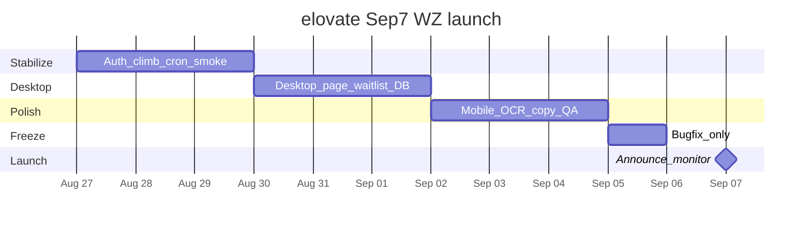

# elovate — Sep 7, 2026 launch roadmap

**Decision:** Public **Warzone-first** launch. Multiplayer stays “coming soon.”  
**Window:** ~11 days (Aug 27 → Sep 7).  
**Live site:** https://elovatesr.netlify.app  
**Repo:** `bubb4rd/elovate`

This doc is the planning artifact: what to ship, what to defer, how to track work with timelines, and how to run AI workflows against that board.

---

## 1. Launch definition (done when…)

| Must be true on Sep 7 | Notes |
|---|---|
| New visitor can see live WZ Top 250 cutoff + board | CODMunity live + Supabase snapshots |
| Discord + magic-link auth works on production | Redirect URLs, no `/?code=` dead ends |
| First-run onboarding → climb goals → `/wz/calc` | Incomplete profiles always land on `/onboarding` |
| Climb sessions sync for signed-in users | Clear failure UI if save fails |
| Public player profiles load without seed demos | Privacy + reputation stable |
| **elovate Desktop** “coming soon” + waitlist/beta opt-in | Home teaser **or** `/desktop` (see §3) |
| MP remains clearly gated as coming soon | No half-open MP routes |
| Ops: cutoff cron healthy (≥24h history for home sparkline) | `poll-wz-cutoff` every 15m |

**Explicitly out of Sep 7 scope**

- Live Multiplayer board / climb
- Notification *delivery* (email/Discord) for cutoff/climb prefs — prefs may stay UI-only
- Full marketing site rewrite
- Native Desktop app binary (waitlist only)

---

## 2. Feature backlog by workstream

Priority: **P0** = launch blocker · **P1** = should ship · **P2** = nice if capacity · **Post** = after Sep 7

### A. Product / WZ polish (P0–P1)

| ID | Item | Pri | Owner hint | Notes |
|---|---|---|---|---|
| WZ-01 | Production auth smoke (Discord + magic link, cold + returning) | P0 | Eng | Cover Netlify + local redirect URLs |
| WZ-02 | Onboarding edge cases (existing auth user, no profile row) | P0 | Eng | Trigger / one-off insert path |
| WZ-03 | Climb cloud sync reliability + visible save errors | P0 | Eng | Already hardened; re-verify on prod |
| WZ-04 | Home 24h sparkline has real ≥24h snapshot history | P0 | Ops | Cron + Vault secret + no seed fallback |
| WZ-05 | Board + climb mobile pass (table, calc, share card) | P1 | Eng | Regression after recent polish |
| WZ-06 | Profile privacy, themes, reputation day-lock | P1 | Eng | Staff/Fragger headers OK as soft unlocks |
| WZ-07 | OCR optional path documented; fail soft without GCP | P1 | Eng | Don’t block launch on Vision keys |
| WZ-08 | Remove “sample season data” footers on happy path | P1 | Eng | Only show when live fetch truly fails |
| WZ-09 | Package/README brand cleanup (`t250track` → elovate) | P2 | Eng | Cosmetic |

### B. elovate Desktop waitlist (P0 for messaging)

| ID | Item | Pri | Notes |
|---|---|---|---|
| DESK-01 | Dedicated `/desktop` page: brand-forward “elovate Desktop” coming soon | P0 | Mirror polish of `MpComingSoon` pattern |
| DESK-02 | Home teaser link/section → `/desktop` (below ModePick or footer-adjacent) | P0 | Keep hero budget clean — not in first viewport clutter |
| DESK-03 | Opt-in form: email and/or Discord account; toggles for **updates** + **beta** | P0 | Auth’d users can prefill from profile |
| DESK-04 | Supabase table `desktop_waitlist` + RLS (insert own / service read) | P0 | Fields: email, user_id?, want_updates, want_beta, created_at, source |
| DESK-05 | Dedupe by email; confirmation UX (“You’re on the list”) | P0 | |
| DESK-06 | Export/list for ops (SQL or simple staff-only query) | P1 | No marketing automation required for launch |
| DESK-07 | Nav/footer link “Desktop” | P2 | Optional discoverability |

**Recommended UX shape**

- Hero on `/desktop`: **elovate Desktop** as the brand signal, one headline, one sentence, one CTA (opt-in).
- Form fields: email (required if logged out), checkboxes “Product updates” / “Beta testing”, submit.
- Logged-in: optional “Use my account email” + store `user_id` for later invites.

### C. Multiplayer (Post — keep gated)

| ID | Item | Pri |
|---|---|---|
| MP-01 | Keep `/mp/*` + ModePick + onboarding MP disabled | P0 (as gate) |
| MP-02 | Post-launch: open board using existing `mp-sr` + seed/live path | Post |
| MP-03 | Post-launch: MP climb + season archive | Post |

### D. Notifications (Post unless easy win)

| ID | Item | Pri |
|---|---|---|
| N-01 | Prefs already on `profiles` (`notify_cutoff`, `notify_climb`) | Done |
| N-02 | Sender job (email or Discord webhook) | Post |
| N-03 | Settings copy already says more channels coming | Keep |

### E. Ops / launch readiness (P0)

| ID | Item | Pri |
|---|---|---|
| OPS-01 | Confirm Netlify env: Supabase URL/keys, `CRON_SECRET`, Discord OAuth | P0 |
| OPS-02 | Supabase Auth Site URL + Redirect URLs for production | P0 |
| OPS-03 | `poll-wz-cutoff` deployed + Vault cron scheduled | P0 |
| OPS-04 | Snapshot count / freshness dashboard check (SQL) day-of | P0 |
| OPS-05 | Soft launch checklist walkthrough (see §5) | P0 |
| OPS-06 | Error monitoring (Netlify logs + Supabase logs) | P1 |
| OPS-07 | Environment build / Cloud Agent snapshot for faster agent loops | P2 |

### F. Post-launch (ordered)

1. MP board live  
2. Notification delivery  
3. Desktop alpha builds + invite from waitlist  
4. Deeper climb analytics / season archives  
5. Community features beyond reputation  

---

## 3. Suggested calendar (Aug 27 → Sep 7)

Use these as **issue date ranges** (start → target), not estimates of person-days.

| Phase | Dates | Focus | Exit criteria |
|---|---|---|---|
| **Stabilize** | Aug 27–30 | Auth, climb sync, cutoff cron, prod smoke | No P0 auth/data bugs on Netlify |
| **Desktop waitlist** | Aug 30–Sep 2 | `/desktop` + table + form + home link | Opt-in persists in Supabase |
| **Polish + harden** | Sep 2–5 | Mobile, footers, OCR soft-fail, README | Happy-path QA script green |
| **Launch freeze** | Sep 5–6 | Bugfix only; no new features | Tag `v1.0-wz` or Netlify prod pin |
| **Launch day** | Sep 7 | Announce + monitor | Waitlist open; WZ live |



---

## 4. How to structure / display / edit timelines for issues

You asked for tooling recommendations (planning only — no board setup in this PR).

### Recommended stack for this repo

**Primary: GitHub Projects (v2) + Issues + Milestone**

| Piece | Use |
|---|---|
| **Milestone** `Launch Sep 7` | Due date `2026-09-07`; all P0/P1 issues attached |
| **GitHub Project** board | Columns: Backlog → Ready → In progress → In review → Done |
| **Issue fields** | Priority (P0–P2), Workstream (WZ / Desktop / Ops / Post), Status |
| **Date fields** | `Start date` + `Target date` (Project date fields) for ranges |
| **Roadmap view** | Project → Roadmap layout to drag date ranges on a timeline |
| **Labels** | `p0`, `p1`, `p2`, `workstream:wz`, `workstream:desktop`, `workstream:ops`, `launch` |

**Why this fit:** repo is already on GitHub; zero extra SaaS; Cloud Agents / `gh` / Cursor PR tools already integrate; Roadmap view is the native way to **see and edit date ranges** on issues.

### Strong alternatives

| Tool | Best when | Timeline UX |
|---|---|---|
| **Linear** | You want faster triage + cycles | Timeline/Gantt; Cycles map to Stabilize / Polish / Freeze |
| **Notion timeline + GitHub sync** | Docs-heavy planning | Beautiful ranges; weaker eng loop unless synced |
| **Plane / Height** | Prefer open-source PM | Timeline views vary |

**Suggestion:** Stay on **GitHub Projects Roadmap** for Sep 7. Revisit Linear only if multi-person triage gets noisy.

### Issue template (copy into each issue)

```md
## Outcome
…

## Workstream
WZ | Desktop | Ops | Post

## Priority
P0 | P1 | P2

## Date range
Start: YYYY-MM-DD
Target: YYYY-MM-DD

## Acceptance criteria
- [ ] …

## Out of scope
…
```

### Mapping this roadmap → first issues

Create one issue per row in §2 (at least all **P0**). Set Project start/target from §3. Milestone = `Launch Sep 7`.

---

## 5. Soft-launch QA script (Sep 5–7)

Run on production:

1. Home: live cutoff numeral; sparkline only if ≥24h history; ModePick WZ live / MP coming soon  
2. `/wz` board loads; season switch works  
3. `/wz/calc` session + share card; signed-in save succeeds  
4. Login Discord → callback → session; magic link cross-tab complete  
5. New user → onboarding → profile slug  
6. `/players/[slug]` public view; private profile honored  
7. `/desktop` opt-in (and logged-out email path) writes waitlist row  
8. `/mp` still coming soon  
9. Settings save notify toggles (no send required)  
10. Force-fail live API once: graceful empty/fallback, no crash  

---

## 6. AI workflows (how to use agents against this plan)

Goal: agents implement/fix against **dated issues**, not open-ended chat.

### A. Cursor Cloud Agents (day-to-day build)

| Workflow | Trigger | Prompt pattern |
|---|---|---|
| **Issue → PR** | Assign issue / paste issue URL | “Implement GitHub issue #N per acceptance criteria; branch `cursor/<slug>-…`; open draft PR” |
| **Launch slice** | Morning of a phase | “Work P0 issues in milestone Launch Sep 7 with target ≤ today; one PR per issue” |
| **QA pass** | Sep 5+ | “Run soft-launch QA script in docs/LAUNCH_ROADMAP.md §5 against production; file bugs as issues” |
| **Desktop slice** | Aug 30–Sep 2 | “Ship DESK-01…05: `/desktop`, waitlist table, form, home link” |

Use **Computer Use** for visual QA of home / desktop / climb after UI PRs.

### B. Cursor Automations (recurring / event-driven)

| Automation idea | Event | Action |
|---|---|---|
| PR hygiene | PR opened | Summarize risk vs launch milestone; flag scope creep (MP, notifications) |
| CI fail | Check failure on `master` / launch branches | Open or comment fix PR |
| Daily standup digest | Cron morning | List open P0 issues past target date |
| Freeze guard | PR to master after Sep 5 | Warn if issue not labeled `bug` |

### C. Repo conventions so AI stays aligned

1. Keep this file as source of truth; agents should read `docs/LAUNCH_ROADMAP.md` first.  
2. Every launch PR references an issue ID + priority.  
3. Prefer small PRs matching one backlog row.  
4. Do not reopen MP routes without an issue marked Post → promoted.  
5. Desktop waitlist schema changes go through Supabase migrations (never dashboard-only).

### D. Optional later: in-product AI

Out of Sep 7 scope. Candidates post-launch: climb advice from session history, OCR correction assist. Not required for Desktop waitlist.

---

## 7. Desktop waitlist — suggested schema (for implementer)

```sql
create table public.desktop_waitlist (
  id uuid primary key default gen_random_uuid(),
  email text not null,
  user_id uuid references public.profiles (id) on delete set null,
  want_updates boolean not null default true,
  want_beta boolean not null default false,
  source text not null default 'desktop_page',
  created_at timestamptz not null default now(),
  constraint desktop_waitlist_email_format check (email ~* '^[^@]+@[^@]+\.[^@]+$')
);

create unique index desktop_waitlist_email_unique
  on public.desktop_waitlist (lower(email));
```

RLS sketch: anon/authenticated **insert**; no public **select**; `service_role` full access for exports.

---

## 8. Decision log

| Date | Decision |
|---|---|
| 2026-08-27 | Sep 7 = WZ-first public launch; MP stays coming soon |
| 2026-08-27 | Add elovate Desktop coming-soon + updates/beta opt-in |
| 2026-08-27 | Timelines/AI = planning artifact (this doc); track work in GitHub Projects Roadmap |

---

## 9. Immediate next actions (human)

1. Create GitHub Milestone **Launch Sep 7** (due 2026-09-07).  
2. Create Project with Roadmap view; add Priority + Workstream fields.  
3. File P0 issues from §2 (especially DESK-01–05 and OPS-01–05).  
4. Kick off Stabilize phase: prod auth + cron smoke.  
5. When ready to build Desktop waitlist, open a Cloud Agent on DESK-* issues.
